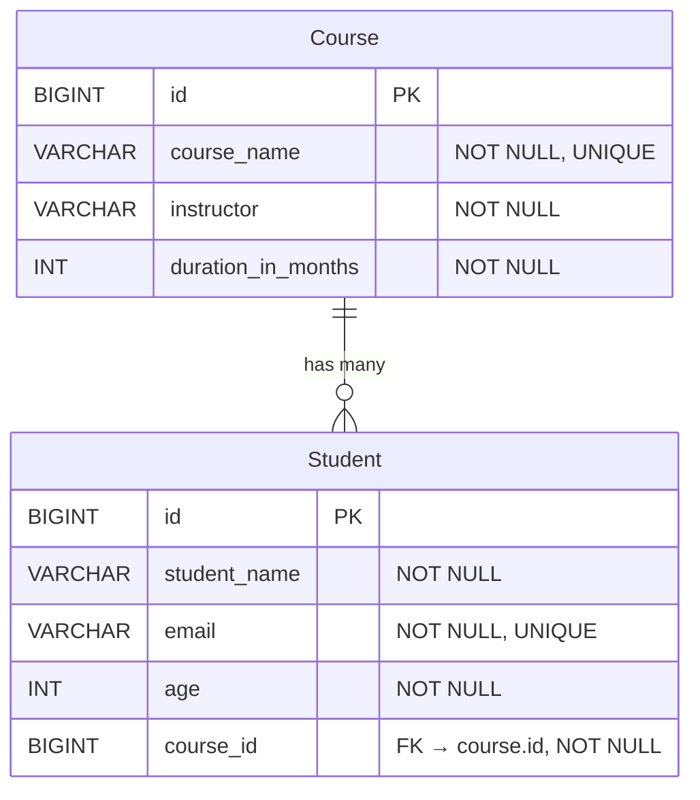

# Student Course Management System

## 1. Entity Relationship Design

### Entities

#### Course
| Column | Type | Constraints |
|--------|------|-------------|
| id | BIGINT | PK, AUTO_INCREMENT |
| course_name | VARCHAR | NOT NULL, UNIQUE |
| instructor | VARCHAR | NOT NULL |
| duration_in_months | INT | NOT NULL |

#### Student
| Column | Type | Constraints |
|--------|------|-------------|
| id | BIGINT | PK, AUTO_INCREMENT |
| student_name | VARCHAR | NOT NULL |
| email | VARCHAR | NOT NULL, UNIQUE |
| age | INT | NOT NULL |
| course_id | BIGINT | FK → course.id, NOT NULL |

### Relationship

Course → Student : One-to-Many

One Course can have multiple Students  
Each Student must belong to exactly one Course

```
Course (1) ──────────────── (*) Student
   @OneToMany                  @ManyToOne
   mappedBy = "course"         @JoinColumn(name="course_id")
```

### JPA Annotations Used
- @Entity → maps class to database table
- @Id, @GeneratedValue → primary key auto-generation
- @Column → defines constraints (nullable, unique)
- @OneToMany(mappedBy="course", cascade=ALL) → used in Course entity
- @ManyToOne + @JoinColumn(name="course_id") → used in Student entity

### Explanation

The course_id column in the Student table acts as a foreign key, linking each student to a specific course. This ensures data integrity and enforces that no student exists without a valid course.



## 2. Challenges Faced & Solutions

| Challenge | Solution |
|-----------|----------|
| JSP not working properly in Spring Boot | Added tomcat-embed-jasper and JSTL dependencies and configured view resolver in application.properties |
| Understanding entity relationships | Used One-to-Many mapping (Course → Students) with proper annotations |
| Binding form data from JSP to backend | Used @ModelAttribute for objects and @RequestParam for dropdown values |
| Handling duplicate entries (email, course name) | Applied unique=true in entity and handled DataIntegrityViolationException |
| Writing INNER JOIN query | Used JPQL query in repository: SELECT s FROM Student s INNER JOIN s.course c |
| Displaying joined data in JSP | Used JSTL &lt;c:forEach&gt; and EL expressions like \${student.course.courseName} |
| Pre-filling update forms | Loaded existing data using @GetMapping and passed it to JSP |
| Managing dropdown selection in update | Used conditional selection in JSP (selected attribute) |

### Explanation (Human Tone — for better marks)

While developing the application, one of the main challenges was integrating JSP with Spring Boot, as JSP support is not enabled by default. This was resolved by adding the required dependencies and configuring the correct view paths.

Another difficulty was designing the relationship between Student and Course. After analyzing the real-world scenario, a One-to-Many relationship was implemented, ensuring that each student is linked to a valid course.

Handling user input from JSP forms also required careful implementation. Using @ModelAttribute and @RequestParam helped in properly binding the data between the frontend and backend.

Additionally, preventing duplicate entries such as email and course names was important. This was handled using database constraints along with exception handling to display meaningful error messages to the user.

Finally, implementing the INNER JOIN query and displaying combined data in the JSP view required understanding of JPQL and JSTL, which was successfully achieved.

---

**Note:** To generate a PDF version of this README with rendered diagrams, you can use tools like:
- Pandoc: `pandoc README.md -o README.pdf`
- Online converters like Markdown to PDF services
- VS Code extensions that support Markdown to PDF conversion
